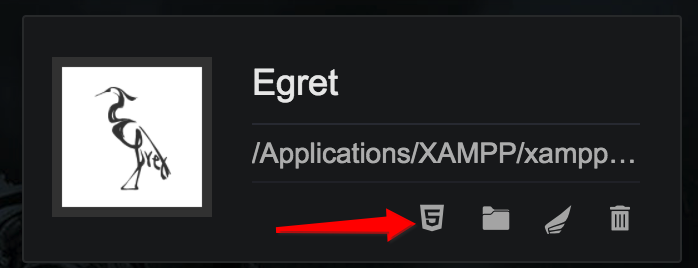

# 项目发布设置使用说明

---

此文档旨在帮助用户顺利的完成项目打包发布，解决发布过程中可能遇到的问题，并最终完成发布工程的个性化配置和功能接入，文档分为以下几个部分：

> * 发布设置前的准备工作
> * 项目发布配置
> * 发布工程的个性化配置
> * JS和原生的通信接入
> * 运行时error事件和state事件处理方法
> * 添加loading界面

---

## 发布设置前的准备工作

- 安装最新版本的launcher
- 确认引擎版本
    - 下载的引擎版本必须为***5.1.6及以上***
    - 在launcher中的引擎页选择下载
- 安装Android Studio
    - 建议版本: 3.0或以上
    - 后续需要在Android Studio中完成发布项目的修改和功能接入  
    
---

## 项目发布配置

### 1. 创建项目

- launcher项目页中，点击创建项目，填入项目名称，并选择引擎版本为5.1.6（或以上），点击创建按钮。

>此文档不涉及具体项目功能，可以关闭 Egret Wing窗口。

### 2. 发布配置

- 在launcher的项目页中找到新创建的项目，点击该项目下的发布设置按钮。

- 点击左侧的Android按钮，然后在右侧页面中，输入应用名称，填写新的应用包名，点击确定。
- 新弹出的窗口中选择点击***打开文件夹***按钮。

---

## 发布工程的个性化配置

- 使用Android Studio打开发布工程

> 第一次打开工程时，如果存在高版本的Gradle，AS会弹出对话框，提示是否将工程中的配置升级为高版本的Gradle配置，此时请选择**Don't remind me again for this project**。
> 
> 如果不小心点错了选项，只需要修改工程的gradle文件即可（不是app的gradle）,如下：

```
dependencies {
    classpath 'com.android.tools.build:gradle:2.3.0'
}
```
- 在project Structure中配置SDK和NDK的合理路径
- 个性化设置
    - 修改游戏地址：将函数`nativeAndroid.initialize`的参数替换为当前游戏的地址。

    >需要注意，如果工程的assets目录下存在game文件，那么此处填写的游戏必须和game文件中的游戏保持一致，否则会出现问题。

    - 控制FPS面板的显示：修改`nativeAndroid.config.showFPS = true/false;`。true为显示，false为隐藏。
    - 控制log在屏幕上的显示时间：修改`nativeAndroid.config.fpsLogTime = 30;`，改为`-1`时是永久显示。
    - 是否禁用核心渲染驱动：修改`nativeAndroid.config.disableNativeRender = false/true`。false为启用核心渲染驱动，true为禁用核心渲染驱动。
    - 是否清理缓存：修改`nativeAndroid.config.clearCache = false/true;`。false为不自动清理缓存，true为自动清理缓存。
    - 控制页面超时时间：修改`nativeAndroid.config.loadingTimeout = 0;`。单位为秒，0为不设置超时。
    
---

## JS和原生的通信接入

### 1. 原生部分
- 在mainActivity的`setExternalInterfaces`方法里配置通信接口
    - `nativeAndroid.setExternalInterface` 注册JS中可以调用的原生函数
    - `nativeAndroid.callExternalInterface`调用JS函数
- `setExternalInterface`方法的第一个参数是JS中调用原生函数的函数名，第二个参数是该原生函数的功能实现
- `callExternalInterface`方法的第一个参数是JS函数的函数名，第二个传入的参数

```java
private void setExternalInterfaces() {
    nativeAndroid.setExternalInterface("sendToNative", new INativePlayer.INativeInterface() {
        @Override
        public void callback(String message) {
            String str = "Native get message: ";
            str += message;
            Log.d(TAG, str);
            nativeAndroid.callExternalInterface("sendToJS", str);
        }
    });
}
```

### 2. JS部分

- `egret.ExternalInterface.call`调用注册过的原生函数

```js
egret.ExternalInterface.call("sendToNative", "message from JS");
```

- `egret.ExternalInterface.addCallback`注册原生中可以调用的JS函数

```js
function sendToJS(msg) {
    console.log(msg);
}
egret.ExternalInterface.addCallback("sendToJS", sendToJS);
```

> 只有通过`setExternalInterface`注册的原生函数，才能在JS中通过`call`调用。
> 只有通过`addCallback`注册的JS函数，才能在原生中通过`callExternalInterface`调用。

---

## 运行时error事件和state事件处理方法

### 1. runtime运行中各个事件的说明
- 事件说明如下

| 流程 | 事件消息 | 事件类型 | 事件意义 |
| :- | :-------- | :--------: | :-------- |
| index加载 | {"error":"load"} | onError | index加载失败 |
| | {"state”:”starting”} | onState | index加载成功 |
| js加载 | {"error":"start"} | onError | js加载失败 |
| | {"state”:”running”} | onState | js加载成功 |
| js运行中 | {"error”:”stopRunning”} | onError   | js崩溃 |


### 2. 监听error事件和state事件的方法

- 首先声明事件关键字符串

```java
public final static String appError = "error";
// 加载首页失败
public final static String errorIndexLoadFailed = "load";
// 启动引擎失败 
public final static String errorJSLoadFailed = "start";
// 引擎停止运行
public final static String errorJSCorrupted = "stopRunning";
public final static String appState = "state";
// 正在启动引擎
public final static String stateEngineStarted = "starting";
// 引擎正在运行
public final static String stateEngineRunning = "running";
```

- 注册对error事件的监听，在函数`setExternalInterfaces`中：

```java
private void setExternalInterfaces() {
    // handle the error Event during the running
    nativeAndroid.setExternalInterface("@onError", new INativePlayer.INativeInterface() {
        @Override
        public void callback(String message) {
            String str = "Native get onError message: ";
    
            try{
                JSONObject jsonObject = new JSONObject(message);
                String error = jsonObject.getString(appError);
                handleErrorEvent(error);
            }
            catch (JSONException e) {
                Log.e(TAG, "onError message failed to analyze");
                return;
            }
    
            str += message;
            Log.e(TAG, str);
        }
});
```

- 注册对state事件的监听，在函数`setExternalInterfaces`中：

```java
private void setExternalInterfaces() {
    // handle the state change Event during the running
    nativeAndroid.setExternalInterface("@onState", new INativePlayer.INativeInterface() {
        @Override
        public void callback(String message) {
            String str = "Native get onState message: ";
    
            try{
                JSONObject jsonObject = new JSONObject(message);
                String state = jsonObject.getString(appState);
                handleStateEvent(state);
            }
            catch (JSONException e) {
                Log.e(TAG, " onState message failed to analyze");
            }
    
            str += message;
            Log.e(TAG, str);
        }
    });
}
```

### 3. 处理具体事件

- 处理具体error事件

```java
// according to the error msg, do different action
private void handleErrorEvent(String error) {

    switch (error) {
        case MainActivity.errorIndexLoadFailed:
            Log.e(TAG, "errorIndexLoadFailed");
            break;
        case MainActivity.errorJSLoadFailed:
            Log.e(TAG, "errorJSLoadFailed");
            break;
        case MainActivity.errorJSCorrupted:
            Log.e(TAG, "errorJSCorrupted");
            break;
        default:
            break;
    }

}
```

- 处理具体state事件

```java
// according to the state msg, do different action
private void handleStateEvent(String state) {

    switch (state) {
        case MainActivity.stateEngineStarted:
            Log.e(TAG, "stateEngineStarted");
            break;
        case MainActivity.stateEngineRunning:
            Log.e(TAG, "stateEngineRunning");
            break;
        default:
            break;
    }
}
```

---

## 添加loading界面

>loading界面的使用依赖与state事件的处理，请先完成上一部分的阅读。

### 1. 打开loading界面

- 在MainActivity的onCreate函数中调用函数showLoadingView

```java
private ImageView launchScreenImageView = null;
private FrameLayout rootLayout = null;

protected void onCreate(Bundle savedInstanceState) {
        super.onCreate(savedInstanceState);
        
        ....
        
        setContentView(nativeAndroid.getRootFrameLayout());

        rootLayout = nativeAndroid.getRootFrameLayout();
        showLoadingView();
    }
    
private void showLoadingView() {
    launchScreenImageView = new ImageView(this);
    Resources res = getResources();
    Drawable drawable = res.getDrawable(R.drawable.bg);
    launchScreenImageView.setImageDrawable(drawable);

    FrameLayout.LayoutParams params = new FrameLayout.LayoutParams(FrameLayout.LayoutParams.MATCH_PARENT,
            FrameLayout.LayoutParams.MATCH_PARENT);
    rootLayout.addView(launchScreenImageView, params);
}
```

### 2. 关闭loading界面

- 收到{"state”:”running”}消息后，调用函数hideLoadingView

```java
private void hideLoadingView() {
    this.runOnUiThread(new Runnable() {
        @Override
        public void run() {
            rootLayout.removeView(launchScreenImageView);
            Drawable drawable = launchScreenImageView.getDrawable();
            launchScreenImageView.setImageDrawable(null);
            drawable.setCallback(null);
            launchScreenImageView = null;
        }
    });
}
```
